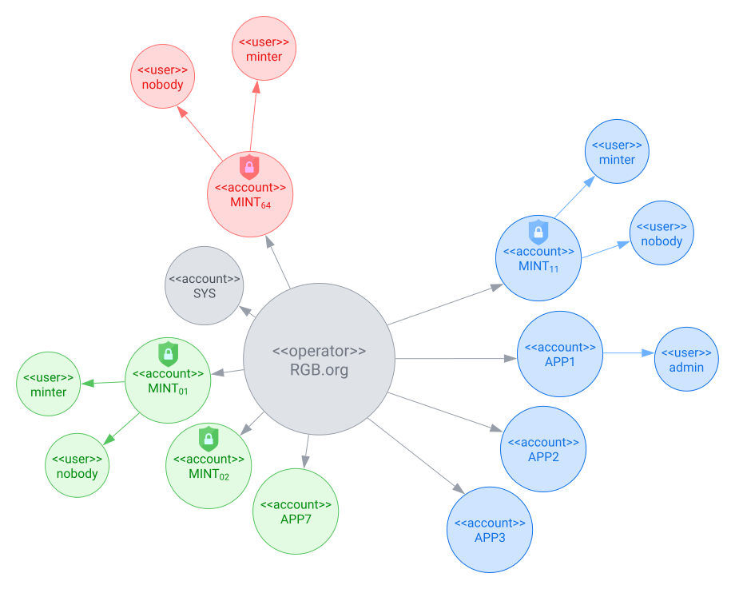
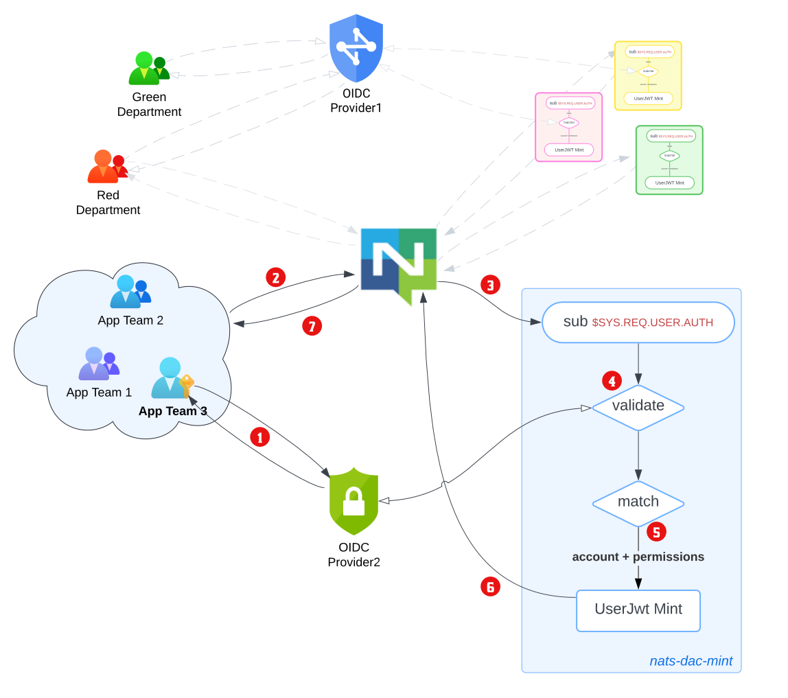

This section walks through the auth callout flow using a realistic multi-tenant scenario.

## Scenario: RGB.org {#sec-rgb-org}

The `RGB.org` organisation has three departments that share a single NATS deployment. A department consists of several teams, with each team developing a set of applications.



The blue department has this setup:

- there are three teams: `App Team 1`, `App Team 2`, `App Team 3`

  - they have each developed apps that require access to NATS.
  - users of `App Team`_`i`_'s apps have NATS credentials minted by NATS account `APPi`

- the department has configured and deployed a shared instance of the nats-iam-broker microservice.
  - the microservice connects to NATS using _user_ `minter` of NATS _account_ `MINT_11`.
  - minting accounts have an additional _user_ `nobody`, that has no permissions.

Bob is a member of `App Team 3`, and wishes to use their in-house app `demo-app`. This section describes the authentication and authorization flow.



1. Bob launches `demo-app`.
   - `demo-app` directs him to `OIDC Provider2` for authentication, which Bob completes.
   - `demo-app` receives back a signed JWT token `jwt.provider2.bob`.
2. `demo-app` obtains credentials[^1] for `MINT_11(nobody)` and packages this into a NATS `authorization_request` (perhaps by calling `nats.connect()`)[^2].

3. NATS creates a `connection_id` for the Bob's instance of `demo-app`, and directs the `MINT_11(nobody)` connection to the blue department's nats-iam-broker microservice. This is because the microservice connects to NATS using `MINT_11(minter)`, and the two have a common NATS account. The connection between NATS and nats-iam-broker is private[^3].

4. nats-iam-broker microservice receives the request.

   - it unpacks `jwt.provider2.bob` and validates the token against `OIDC Provider2`.
   - it performs additional validations, like checking JWT expiry/clock skew, etc.
   - an unsuccessful validation reports an `Authorization Violation` back to the user.

5. nats-iam-broker microservice mints a new JWT.

   - it inspects Bob's user/profile information in `jwt.provider2.bob`.
   - it determines that the account to issue+sign the minted token is `APP3`.
   - it creates a set of unique authorizations for Bob's `demo-app` usage.
   - it sets a suitable token expiry etc.

6. nats-iam-broker signs the minted JWT, encrypts it for transport and sends it to NATS server.
7. NATS server decrypts[^3] and validates the nats-jwt, and binds the authorizations to the client's `connection_id`. Finally, it notifies Bob's instance of `demo-app` of the successful connection.

[^1]: although `nobody` user credentials have no NATS permissions, storing them externally can facilitate key rotation of `signing_key(MINT_11)`.

[^2]: a (somewhat) arbitrary decision has been made to pass the third-party JWT in the password field, i.e., `nats.Connect(UserCredentials(MINT_11(nobody)), password=jwt.provider2.bob)`

[^3]: this uses the `XKey` field. It is optional but recommended.

## Minimal Configuration

A simpler setup consisting of one auth callout account (`MINT`) and one application account (`APP1`):

```yaml
# env.yaml
nats:
  url: "nats://localhost:4222"
  jwt_expiry_bounds:
    min: 1m
    max: 1h
service:
  name: "my-iam-broker"
  description: "IAM Broker"
  version: "0.1.0"
  creds_file: "/secrets/user.creds"
  account:
    name: "MINT"
    signing_nkey: "<MINT_SIGNING_NKEY>"
    xkey_seed: "<XKEY_SEED>"

# idp.yaml
idp:
  - description: "My IDP"
    issuer_url: "https://idp.example.com"
    client_id: "my-client-id"

# rbac.yaml
rbac:
  user_accounts:
    - name: APP1
      public_key: "<APP1_PUBLIC_KEY>"
      signing_nkey: "<APP1_SIGNING_NKEY>"

  role_binding:
    - user_account: APP1
      match:
        - { claim: aud, value: "my-client-id" }
      roles:
        - default-access

  roles:
    - name: default-access
      permissions:
        pub:
          allow: ["app.>"]
        sub:
          allow: ["app.>"]
```

```bash
nats-iam-broker serve env.yaml idp.yaml rbac.yaml
```

For full configuration details, see the [Configuration Reference](configuration.qmd).
